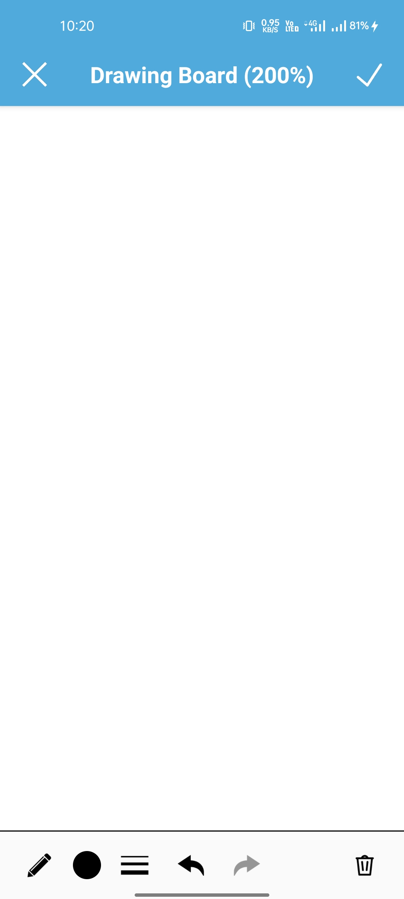
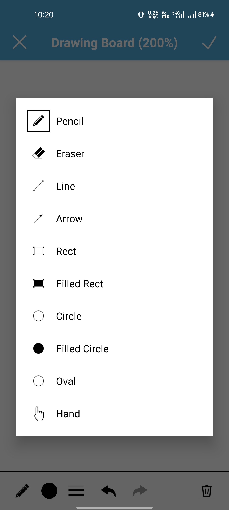
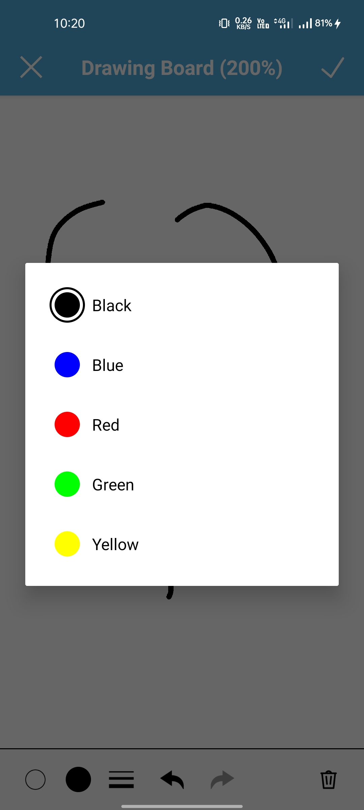
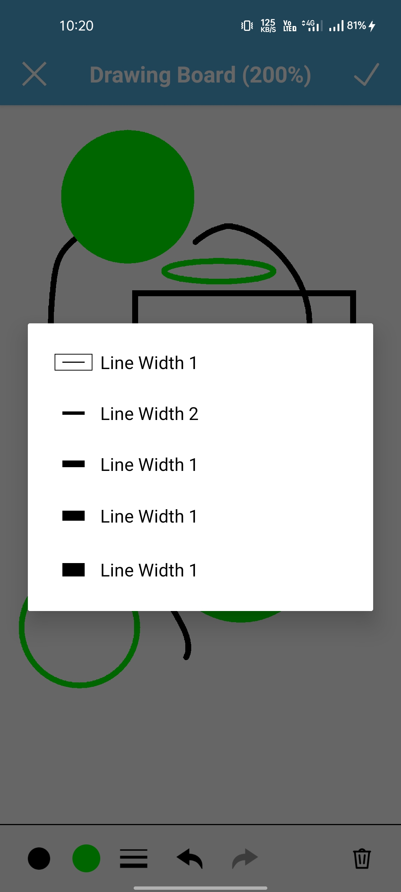
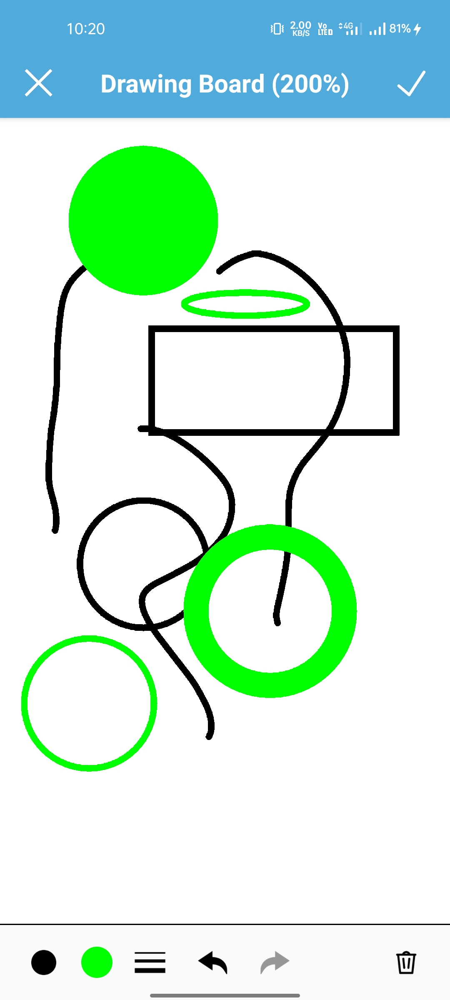

# Drawing Board

A canvas based drawing board for android with a paint brush and shapes drawing feature.

<!-- Get it from Playstore: -->

<!--  -->

# Features:  
<ul>
  <li>Inbuilt paint brush/pencil</li>
  <li>Color selection</li>
  <li>Choose different shapes and colors</li>
  <li>Save to local in png format</li>
</ul>

## Screenshots

# Tools:  
<ul>
  <li>Kotlin/Native android</li>
  <li>Room {Only for some annotation purposes}</li>
  <li>Canvas</li>
  <li>Lifecycle</li>
  <li>DataBinding</li>
</ul>

You can contact me at: prasoonk187@gmail.com 
